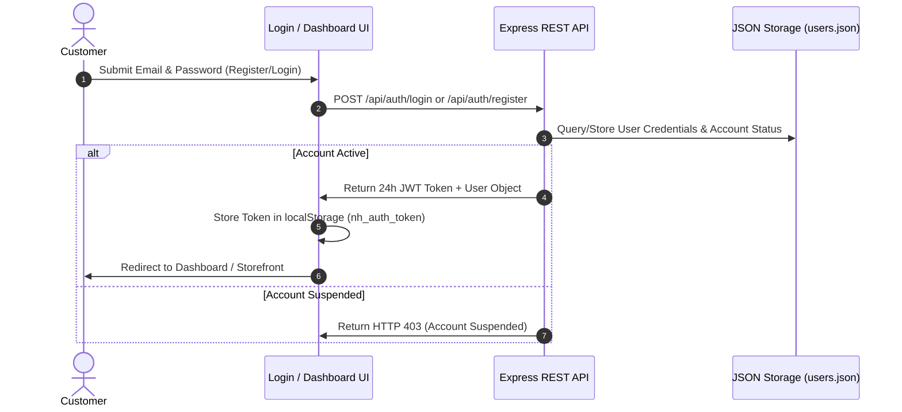
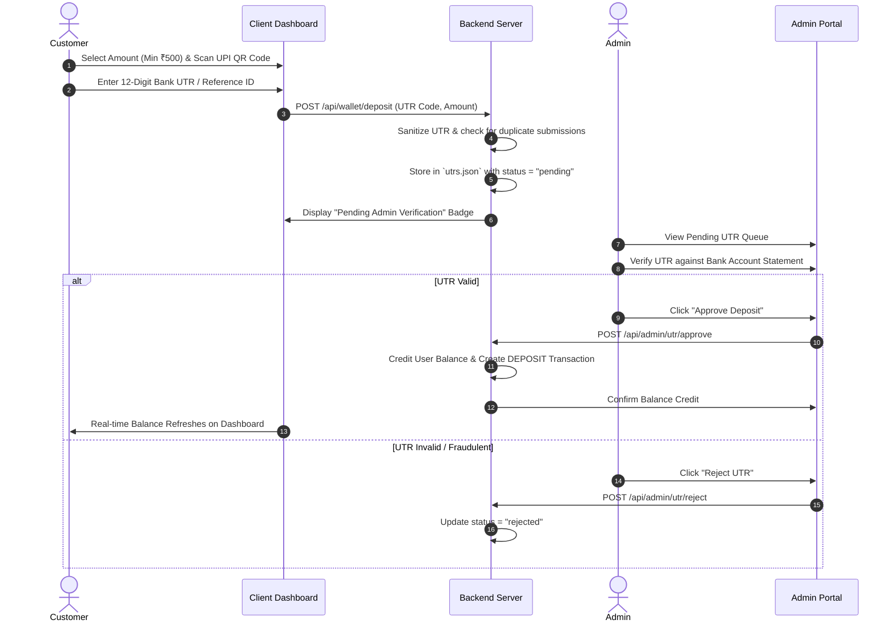
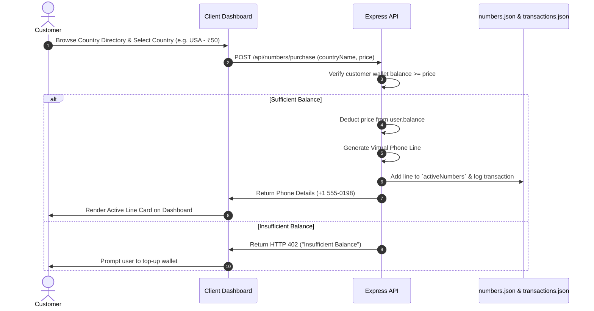

# ⚡ NumberHub - Virtual Number & eSIM Store Platform
## Complete Site Workflow, Architecture & Master Deep Analysis Prompt

---

# 🌐 Part 1: Complete System Workflow & Architecture

## 1. Executive Summary & Tech Stack

**NumberHub** is a full-stack, monitored virtual phone number & eSIM acquisition platform. It enables customers to deposit funds via UPI (UTR verification model), purchase global virtual lines across 60+ countries, and receive SMS verification OTP codes for services like Telegram, WhatsApp, and OpenAI. It includes a comprehensive Admin Surveillance & Management suite.

* **Backend Engine:** Node.js + Express.js (`server.js`)
* **Security & Auth:** JWT (JSON Web Tokens) with 24h expiration + Express Rate Limiting
* **Database & Persistence:** Dual-layer strategy using in-memory state synced atomically with JSON flat-file storage (`users.json`, `utrs.json`, `numbers.json`, `transactions.json`, `logs.json`)
* **Frontend Pages:** Vanilla HTML5 / JavaScript (`index.html`, `login.html`, `dashboard.html`, `admin.html`, `transactions.html`, `app.js`, `styles.css`)

---

## 2. End-to-End Core Workflows

### 🔄 Workflow 1: Customer Onboarding & Authentication


---

### 💳 Workflow 2: Wallet Funding via UTR Verification Queue

Since automated payment gateways can have high compliance overheads, NumberHub uses a **Manual Admin-Verified UTR Deposit System**:



---

### 📱 Workflow 3: Virtual Number / eSIM Line Acquisition



---

### 📩 Workflow 4: SMS Verification OTP Ingestion & Inbox Delivery

1. **Service Registration:** Customer copies their allocated virtual number (+1 555-0198) and pastes it into Telegram/WhatsApp.
2. **OTP Ingest Trigger:** The target platform dispatches an SMS verification code.
3. **Dispatch Handler:** Admin or Webhook dispatches OTP via `POST /api/admin/sms/send`.
4. **Inbox Rendering:** Server matches `targetPhone` to `userId`, pushes the message object into `db.smsMessages`, and updates client inbox real-time on `GET /api/sms/inbox`.

---

### 🛡️ Workflow 5: Admin Surveillance & Account Governance

The server logs every user action via `logClientActivity()`:
* **Log Ingested Data:** User ID, Name, Action Type (`LOGIN`, `NUMBER_PURCHASE`, `UTR_DEPOSIT_SUBMITTED`), Timestamp, IP Address.
* **Governance Controls (`admin.html`):**
  * **Status Toggle:** Suspend/Unsuspend any client account (`POST /api/admin/clients/status`).
  * **Balance Adjustment:** Manually adjust wallet balance with mandatory reason tracking.
  * **Line Management:** Revoke/delete virtual numbers allotted to any user.
  * **Mass Actions:** Reject all pending UTR deposit requests with a single click.

---

## 3. Data Schema & REST API Summary

| Endpoint | Method | Role | Description |
| :--- | :--- | :--- | :--- |
| `/api/auth/login` | `POST` | Public | Authenticates user, issues 24h JWT token. |
| `/api/auth/register` | `POST` | Public | Registers customer account with instant login token. |
| `/api/user/profile` | `GET` | Customer | Fetches current user profile and live balance. |
| `/api/wallet/deposit` | `POST` | Customer | Submits UTR reference code for wallet top-up queue. |
| `/api/numbers/purchase` | `POST` | Customer | Purchases virtual phone line, deducts balance. |
| `/api/sms/inbox` | `GET` | Customer | Fetches received OTP codes for active numbers. |
| `/api/user/transactions` | `GET` | Customer | Fetches complete financial deposit & purchase history. |
| `/api/admin/utrs` | `GET` | Admin | Fetches all pending & historical UTR requests. |
| `/api/admin/utr/approve` | `POST` | Admin | Approves UTR deposit & credits client balance. |
| `/api/admin/utr/reject` | `POST` | Admin | Rejects invalid UTR deposit request. |
| `/api/admin/clients` | `GET` | Admin | Lists all monitored clients with metrics. |
| `/api/admin/clients/balance`| `POST` | Admin | Manually overrides user wallet balance. |
| `/api/admin/sms/send` | `POST` | Admin | Dispatches simulated/real SMS OTP to user line. |
| `/api/admin/logs` | `GET` | Admin | Returns real-time activity surveillance logs. |

---

# 🤖 Part 2: Master Deep Analysis Prompt

```text
================================================================================
MASTER TECHNICAL ANALYSIS & AUDIT PROMPT FOR NUMBERHUB ESIM & VIRTUAL NUMBER STORE
================================================================================

You are tasked with conducting a deep, rigorous, end-to-end technical analysis and security audit of the NumberHub platform codebase (located at `c:/Users/himanshu/Desktop/esim`).

### 1. CODEBASE SCOPE & TARGET FILES
- Backend Server: server.js
- Core Frontend Application: app.js
- Markup Pages: 
  - index.html
  - login.html
  - dashboard.html
  - admin.html
  - transactions.html
- JSON Data Persistence Layer:
  - users.json, utrs.json, numbers.json, transactions.json, logs.json

---

### 2. ANALYSIS REQUIREMENTS & STRUCTURED DELIVERABLES

Please analyze the codebase and provide a comprehensive report covering the following 6 core dimensions:

#### SECTION A: ARCHITECTURAL & SYSTEM DESIGN EVALUATION
1. Assess the monolithic Express.js + JSON flat-file storage design. Evaluate data concurrency risks under high concurrent write operations.
2. Analyze the JWT token verification flow (authenticateToken vs optionalAuthToken). Identify any authentication bypass vulnerabilities or fallback edge cases.
3. Review the in-memory db state sync model (loadDataFromDisk() and saveDataToDisk()). Highlight potential race conditions or data loss scenarios during unexpected server restarts.

#### SECTION B: SECURITY & VULNERABILITY AUDIT (OWASP TOP 10)
1. Authentication & Authorization: Check if role-based access control (requireAdmin) is strictly enforced on all administrative routes.
2. Payment Fraud Analysis: Inspect the UTR submission (/api/wallet/deposit) and approval handlers. Test if clean UTR sanitization prevents replay attacks or double-credit vulnerabilities.
3. Password Security: Evaluate password handling in users.json (check for plain-text storage vs bcrypt/argon2 hashing).
4. Input Sanitization & Injection: Inspect all JSON body parameters across POST endpoints for potential XSS, prototype pollution, or denial of service vectors.

#### SECTION C: DATA INTEGRITY & FINANCIAL RECONCILIATION
1. Verify balance calculation math during number purchase (/api/numbers/purchase) and admin adjustments (/api/admin/clients/balance). Check for floating point precision issues (e.g. 0.1 + 0.2 rounding errors in JavaScript numbers).
2. Assess transaction log completeness. Ensure every balance modification (Deposit, Purchase, Admin Top-Up) creates a corresponding transaction entry in transactions.json.

#### SECTION D: FRONTEND UX & CLIENT-SIDE SECURITY AUDIT
1. Examine token handling in localStorage (nh_auth_token). Suggest XSS mitigations (e.g. switching to HttpOnly SameSite cookies).
2. Check real-time UI synchronization: How does the client dashboard react when an admin approves a UTR or dispatches an SMS code?

#### SECTION E: SCALABILITY & PRODUCTION READINESS ROADMAP
1. Outline a migration path from JSON flat-file storage to a relational database (PostgreSQL + Prisma) or NoSQL (MongoDB/Redis).
2. Provide concrete recommendations for integrating real SMS API gateways (e.g., Twilio, 5sim, SMS-Activate API webhooks).
3. Recommend automated payment gateway integration (Razorpay/Cashfree webhooks) to eliminate manual UTR approval bottlenecks.

#### SECTION F: ACTIONABLE REFACTORING & FIX PLAN
Produce a prioritized step-by-step table of recommendations categorized by:
- Critical (Immediate Security/Data Fixes)
- Major (Performance & Database Migration)
- Minor (UI/UX & Code Quality Polish)

================================================================================
```